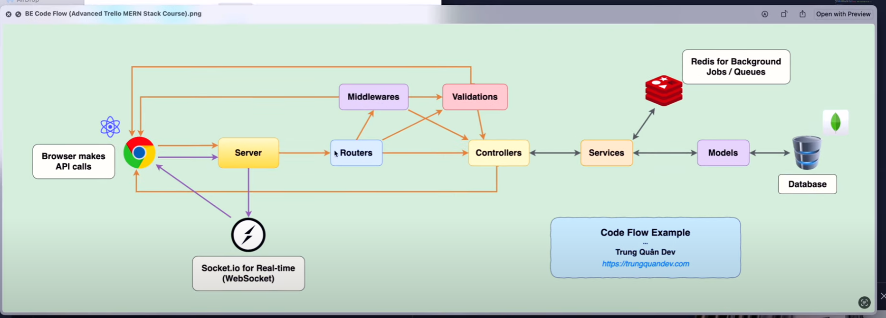

<h1>Trello Backend</h1>

### Requirements (Semantic Versioning)

```
* nodejs >= 18.16.0
* npm = v10.5.2

* "express": "^4.18.2"
* "nodemon": "^3.0.1"
* "eslint": "^8.47.0"

* "@babel/runtime": "^7.22.10"
* "@babel/cli": "^7.22.10"
* "@babel/core": "^7.22.10"
* "@babel/eslint-parser": "^7.22.10"
* "@babel/node": "^7.22.10"
* "@babel/plugin-transform-runtime": "^7.22.10"
* "@babel/preset-env": "^7.22.10"
* "babel-plugin-module-resolver": "^5.0.0"
```

### About Me - Thông tin về mình:

```
My name - Tên: Nguyễn Đình Anh Hào
My school and major - Trường và ngành học: Trương trình liên kết giữa Trường Đại học Khoa học Tự nhiên, Đại học Quốc gia Thành phố Hồ Chí Minh (University of Science - HCMUS) và Trường đại học công nghệ Auckland (AUT) - ngành khoa học dịch vụ(Science Service)
CV: https://www.topcv.vn/xem-cv/AgUAAAFaCwYIU1VXAwVaU1UBBllRVwBeAgRQBAafe2
Github: https://github.com/ohan49
```

### What am I learning in this project - Những gì mình tìm hiểu trong project này:

```
Project này hướng tới cải thiện kỹ năng lập trình back-end thông qua dự án trello.
Tất cả những kiến thức và kỹ năng trong project này được mình tham khảo qua kênh Youtube: TrungQuanDev - https://youtube.com/@trungquandev.
```

### Code Flow:

```

```